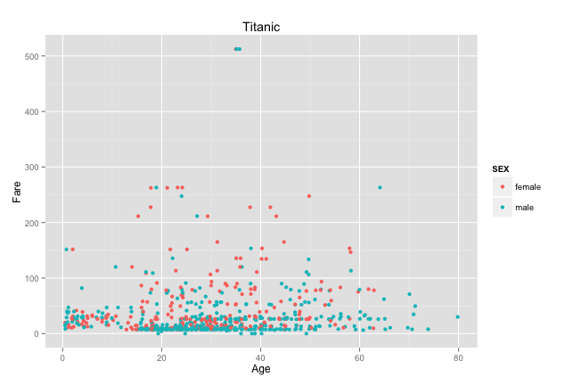
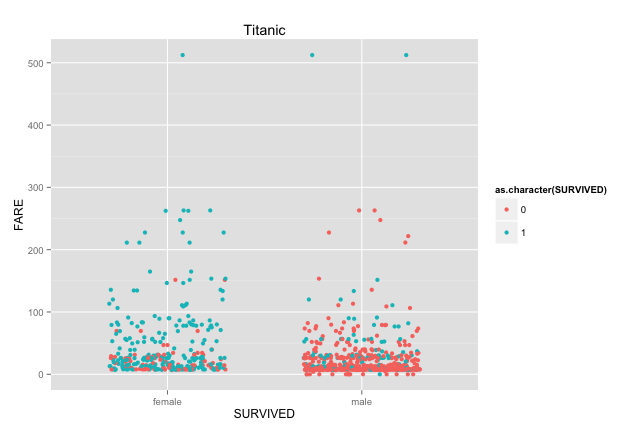
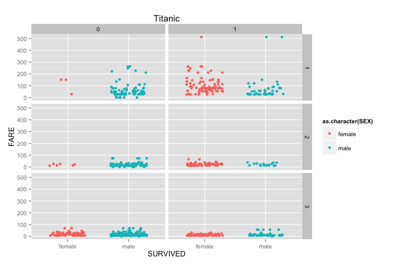
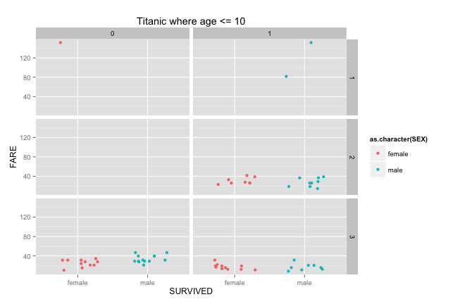
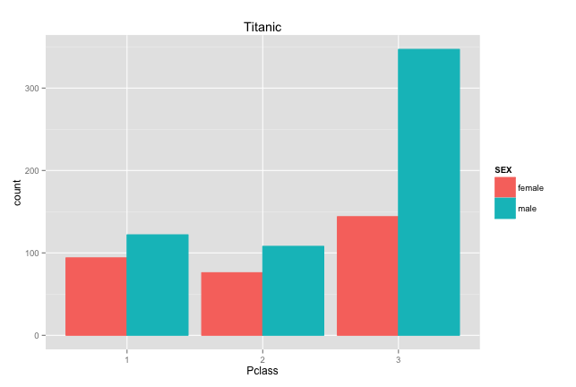

_Group Members: Aura Maria Salazar, Adriana Murga_

The purpose of this document is to show the steps we took to finish this project. The data used was taken from Titanic data which provides information about the survival of the passengers of the Titanic according to their class, sex and age.  
Here is a summary of the data we used:

```{r}
source("../01 Data/DataFrame.R", echo = TRUE)

```
```{r}
head(df1)
```

##The Steps 
The steps we took followed the guidelines required for this project. 

1. Our first step was to create a GitHub Repository named DV_RProject1 

2. Cloned the DV_RProject1 Repository into a DV_RProject1 folder in your Data Visualizaiton Folder. All of our project was developed in this repository.

3. Created an RStudio Project for the DV_RProject1 folder

4. Created the following structure in the RStudio DV_RProject1 Project:
      - 00 Doc - This folder contains the .Rmd file and some images we imported to show the graphs we made. 
      - 01 Data - This folder contains the general data freame we used in our project
      - 02 Visualizations - This folder contains the .R scripts with the different graphs
      
5. Wrote the R scripts with the necessary SQL query adjustments to produce the graphs asked by professor Cannata. All of these scripts can be found under the Visualization folder of our repository. They show the R and SQL used to produce each graph. 

6. Created a knitr document to show all the steps we took to make this project and display our findings. In this document we included a summary of the Titanic data frame (as seen at the top of the document), as well as the images of the plots we were asked to make. Such plots can be found below. 


## The Graphs

###Graph 1
In the first plot, what surprised us the most was that there were only 3 people who paid more than $500.00 per ticket. Apart from that, it is noticeable that there was a majority of men in the ship and that most of the passengers bought low prices fares. 


###Graph 2
Unlike the previous graph, in this graph we cleaned the data and corrected it so that it displayed only the passengers whose sex was documented. Our SQL query selected the titanic data where sex was not null. In this second plot we see once again that females tended to pay a higher fare than males.Also, it shows that most passengers were around their 20's to 40's, and surprisingly there were more young passengers than elderly. Passengers with ages greater than aroun 65 were all men. 


###Graph 3
In this third plot we can see that more males died, this was probably due to the fact that they were saving women first. Interestingly you can also see that the people who paid above $500 survived, regardless of gender. 



###Graph 4
In this plot, it is easier to see who survived given their social status (class). We can see how there wasn't much of a variation between males' survival accross classes, very few males regardless of the class survived. However, we can see how almost every women in class 1 survived, while women in lower classes had tougher fate.



### Graph 5
This table displays the data of kids, with ages less than or equal to 10. More kids from lower classes died, and there doesn't seem to be a difference among sex. 



###Graph 6
Finally, we conclude with the graph we decided to create. This graph displays the number of passengers per class making the distinction between males and females. It shows that there were significantly more males from class 3 than from lower classes, while the distribution of females was more equal among classes. 

